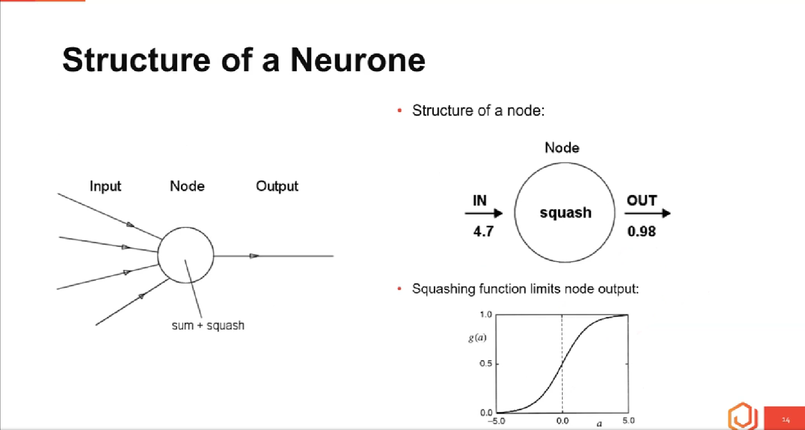
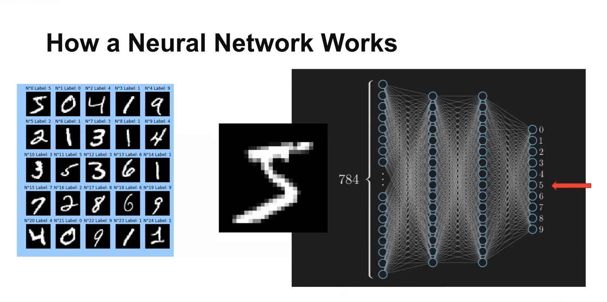

# Generative AI training at the Open University of Kenya (OUK)

Journey with me in this 10 weeks program in the journey to get in-depth knowledge Generative Artificial Intelligence. In pursuit of the know-how this Gen AI work, the science behind them, the underlying architecture and at the end of the program have the ability to create my own AI application using the tools and language learnt.

## First Lecture by Dr. Jason Mars

Take away: In the current era we are in; the greatest limitation is our mindset. It is our responsibility to 'Imagine, Create, Learn'

### How the models work

The use of Artificial Neural Networks (ANN). In an experiment conducted in the early 1980's scientist discovered that a bird in captive could differentiate between paintings by different artists. This led to research of how to make computers have the human intuition and reasoning by replicating the working of the human brain. Since the human brain utilises neurons to differentiate between different scenarios, the scientists decided to model ANN to replicate the intuition process which led to amazing results that have advanced to the creation of the current LLMs (Large Language Models). The use of Input -> Node -> Output.

#### Fundamental components of biological neural nets

1. Neurones (nodes)
2. Synapses (weights)

#### Structure of a neurone

